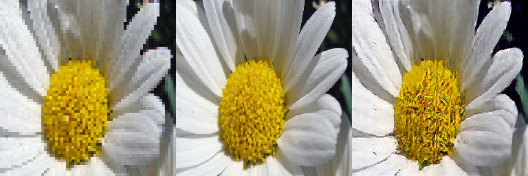

# super resolution

## pix2pix

## Data Augmentation
```bash
$ bash data_augmentation.sh
```
## Train
```bash
$ bash pix2pix-superresolution.sh
```

## Tensorboard
```bash
$ tensorboard --logdir ./log
```

## Result
```bash
$ ls output
epoch_0.jpg
....
epoch_100.jpg

```


## test
```bash
$ bash inference.sh
$ ls generate_image

```




### Reference
 - https://www.tensorflow.org/tutorials/generative/pix2pix
 - https://phillipi.github.io/pix2pix/
